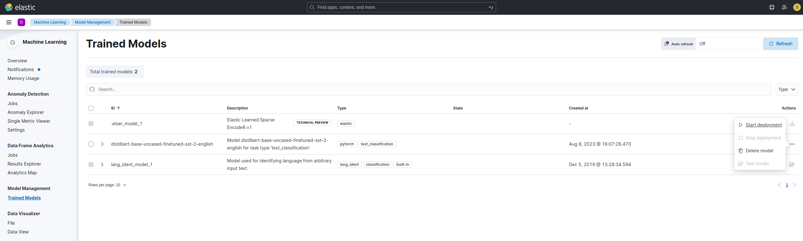
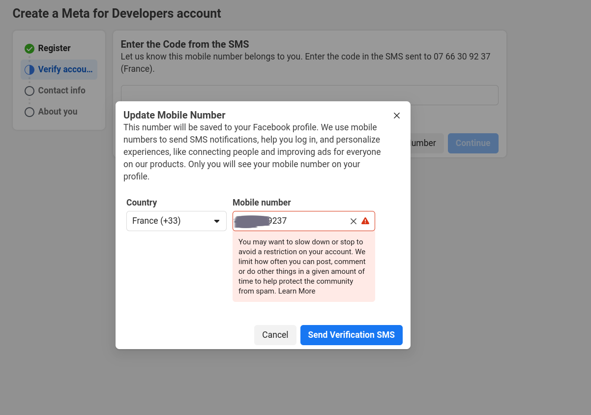

# Test technique (ELK – Scraping)
## Installing Elasticsearch and kibana on ubuntu 22.04
From the link provided, click https://www.elastic.co/fr/downloads/elasticsearch to download Elasticsearch.
Do the same for kibana https://www.elastic.co/fr/downloads/kibana

Elasticsearch requires Java to run. I'm going to install the latest version (Elasticsearch-8.9.0) which needs java 11.

### Installation Steps

1. **Install Java:**
   Open a terminal and run the following commands based on your Linux distribution:

   ```
   sudo apt update
   sudo apt install default-jre
   ```
2. **Extract the Archive:**

   Navigate to the directory where you downloaded the Elasticsearch package and use the following command to extract the archive:

   ```
   tar -xzf elasticsearch-8.9.0-linux-x86_64.tar.gz
   ```

3. **Configure Elasticsearch:**

   Navigate into the extracted directory:

   ```
   cd elasticsearch-8.9.0
   nano config/elasticsearch.yml
   ```
   Change these configurations:
   - `cluster.name`: Ml_sentiment (use any name you want, I used Ml_sentiment).

   - `node.name`: [ ml_node1, node-2]

   - `node.roles`: [ ml, master, remote_cluster_client, data] (ml is necessary and remote_cluster_client is recommended to work on machine learning for Q2)

   - `cluster.initial_master_nodes`: ["ml_node1", "node-2"]

   - `xpack.ml.enabled`: true (required for machine learning)

   These are the only modifications that I made.

4. **Start Elasticsearch:**

   To start Elasticsearch, run the following command from the Elasticsearch directory:
   ```
   ./bin/elasticsearch
   ```
   When running for the first time, this will return password, HTTP CA certificate and kibana enrollement token. Save them in a secure place.

5. **Extract the Archive for Kibana**

   Open a new terminal, navigate to the directory where kibana is downloaded, and extract the archive
   ```
   tar -xzf kibana-8.9.0-linux-x86_64.tar.gz
   ```
6. **Start Kibana:**

   Move to the extracted directory and run kibana as follows:
   ```
   cd kibana-8.9.0
   ./bin/kibana
   ```
   Click in the link provided (http://localhost:5601/ in my case) and login with the username (default `elastic`) and the password saved from elasticsearch.
   
   

## Add login authentication to ELK connection 
To add a new user to ELK, after you logged-in, 

1. Click on the **Management**>Dev Tools tab in the left-hand navigation menu.

2. In the Dev Tools interface, use the following code snippet to create a new user named "serawork" with a password and assigned roles:

```
POST /_security/user/serawork
{
  "password" : "pwd09**",
  "roles" : [ "kibana_admin", "monitor", "manage", "all" ]
}
```
3. Execute the code and logout and signin with the new created user.

## Integrate a sentiment classification feature

I used Eland to import a trained machine learning model and followed the instruction written https://www.elastic.co/guide/en/machine-learning/master/ml-nlp-import-model.html to import the trained model. 

```
eland_import_hub_model \
--url <url> -u "serawork" -p <password> \
--hub-model-id "distilbert-base-uncased-finetuned-sst-2-english" \
--task-type "text_classification" \
--start
```
This will download and integrate model distilbert-base-uncased-finetuned-sst-2-english from Hugging Face Model Hub.

**N.B.** Go to kibana config file to get the exact url. 

## Integrate the sentiment classification service into ELK

To deploy the imported model, click on "Trained Models" tab under **Machine Learning > Model Management**.

You will find distilbert-base-uncased-finetuned-sst-2-english in the list of models. 



Test the model either using the user interface as 


or using this code in console 

```
POST /_ml/trained_models/distilbert-base-uncased-finetuned-sst-2-english/_infer
{
  "docs":[{"text_field": "He is singing because he can't sleep."}]
}
```
## Web scraping

1. **Install Monogodb** from https://www.mongodb.com/try/download/community. Download the right file for your platform and install the .deb as:
   ```
   sudo dpkg -i mongodb-mongosh_1.10.3_amd64.deb
   ```
   Start the demon
   ```
   sudo systemctl start mongod
   sudo systemctl status mongod
   ``
2. Get Facebook  
I don't have meta developer account and there is a problem with the website to verify phone number and finalize registration. 



It seems an issue with meta as shown in threads https://communityforums.atmeta.com/t5/Quest-Development/Can-t-verify-my-developer-account/td-p/1069304, https://communityforums.atmeta.com/t5/Quest-Development/Can-t-verify-my-developer-account/td-p/1069304. 

Because of the deadline, instead of submitting the untested scraper for facebook and instagram (fb-scraping.py), I performed the task on reddit (reddit-scrapping.py).

3. Run `reddit-scrapping.py'
   ```
   python3 reddit-scrapping.py
   ```
4. Check the extracted database.

   


   

   
